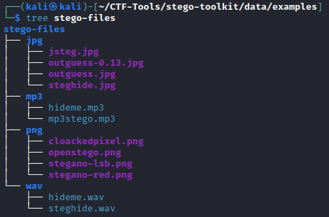

# **Wanná**

| Tên | Mô tả | Deadline |
|------|-------------|----------|
|[**Stego toolkit**](#stego-toolkit)| Chạy được toàn bộ tool trong https://github.com/DominicBreuker/stego-toolkit<br>Viết writeup setup cách chạy và demo | 13/06/2022|
| [**Volatility**](#volatility) | Cài Volatility 2 và Volatility 3 <br> Cài đặt các plugin khác: https://github.com/superponible/volatility-plugins và mimikatz<br>-> Không Failed to import ...<br>Mô tả các plugin trong Volatility<br>Snapshot lại máy ảo đã cài đặt | 21/7/2022 |

# **Stego toolkit**

Sau khi đọc sơ qua nội dung trong link github thì mình phải cài đặt Docker trước khi có thể sử dụng tool.

## **Cài đặt Docker**

Làm theo hướng dẫn của [Microsoft][1], sau khi chạy `sudo apt update` thì ta sẽ gặp lỗi.


Lí do là vì file `/etc/apt/sources.list.d/docker.list` bị sai.

=> Thay lại `kali-rolling` thành `buster`
```
deb [arch=amd64 signed-by=/etc/apt/keyrings/docker.gpg] https://download.docker.com/linux/debian kali-rolling stable
-> deb [arch=amd64 signed-by=/etc/apt/keyrings/docker.gpg] https://download.docker.com/linux/debian buster stable
```


Done! Làm tiếp theo hướng dẫn trong trang của Microsoft là cài xong Docker.

## **Tool sử dụng CLI**

Để sử dụng stego-toolkit, sau khi cài đặt Docker và clone repo về, chỉ cần chạy `sudo .../stego-toolkit/bin/build.sh` để build image và sau đó `sudo .../stego-toolkit/bin/run.sh` để chạy tool. Sau khi chạy ta sẽ bên trong bash shell của container. Ta chỉ cần thêm file cần phân tích vào `.../stego-toolkit/data/` và vào shell của tool để sử dụng các tool đó.

Trong repo của stego-toolkit đã có sẵn folder `examples` nên mình sẽ copy nó vào trong `/data/` và chạy `create_examples.sh`


ta được các file trong `/data/examples/stego-files/`



### **Demo**

| Tool | File hỗ trợ | Mô tả | Demo |
|------|-------------|-------|------|
| AudioStego (hideme)   | WAV, MP3 |  | [redirect](./Demo.md/#audiostego-hideme)   |
| jphide/jpseek         | JPG |  | [redirect](./Demo.md/#jphidejpseek) |
| jsteg                 | JPG |  | [redirect](./Demo.md/#jsteg) |
| mp3stego              | MP3 |  | [redirect](./Demo.md/#mp3stego) |
| openstego             | PNG |  | [redirect](./Demo.md/#openstego) |
| outguess              | JPG |  | [redirect](./Demo.md/#outguess) |
| spectrology           | WAV |  | [redirect](./Demo.md/#spectrology) |
| stegano               | PNG |  | [redirect](./Demo.md/#stegano) |
| Steghide              | JPG, BMP, WAV, AU |  | [redirect](./Demo.md/#steghide) |
| cloackedpixel         | PNG |  | [redirect](./Demo.md/#cloackedpixel) |
| LSBSteg               | Images (PNG, BMP,...) in uncompressed format |  | [redirect](./Demo.md/#lsbsteg) |
| f5                    | JPG |  | [redirect](./Demo.md/#f5) |
| stegpy                | PNG, GIF, BMP, WebP, WAV |  | [redirect](./Demo.md/#stegpy) |


## **Tool sử dụng GUI**

[1]: https://docs.docker.com/engine/install/debian/

# Volatility
